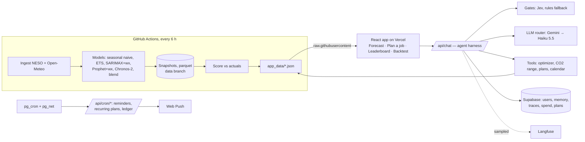

# GreenWindow

*When is the cleanest time to run my electricity-hungry job in the next 48 hours, and how sure are we?*

GreenWindow forecasts Great Britain's grid carbon intensity hourly for the next 48 hours with classical
time-series models and the Chronos-2 foundation model, turns the forecast into a start-time recommendation
for a flexible job, and scores itself against actuals and the grid operator's own forecast. A chat assistant
plans jobs on top of the same forecast, with every number coming from deterministic tools.

**Live:** https://greenwindow-one.vercel.app · Design: [`greenwindow-design-spec.md`](greenwindow-design-spec.md) ·
Assistant: [`docs/agent-prd.md`](docs/agent-prd.md), [`docs/agent-design.md`](docs/agent-design.md),
[`docs/agent-execution-plan.md`](docs/agent-execution-plan.md) · Decisions: [`docs/decisions.md`](docs/decisions.md)

## Architecture

## Forecasting results

90 daily backtest origins (Jul–Oct 2026), 48-hour horizon ([`docs/results.md`](docs/results.md)). MASE < 1 beats
seasonal naive.

| Model | MASE | 80% band coverage |
|---|---|---|
| NESO as published (lead time unknown, not a fair head-to-head) | 0.339 | – |
| Chronos-2 + Prophet blend | **0.470** | 83% |
| Chronos-2 + weather | 0.484 | 83% |
| Seasonal naive (yesterday), the benchmark | 1.185 | 80% |

Backtest weather comes from archived forecasts, so weather models look better than they will live; the live
leaderboard on the site is the unbiased check. Negative results are kept: SARIMAX + weather and ETS barely beat the
benchmark.

## The assistant

"Charge my EV by 7am", "three kilns, 8 h each, 12 kW, done by Monday 8am", "every weekday, best 3 h for the
compressor before 5pm". The assistant answers in a few sentences, updates the planner panel next to it, and shows
"How I got this" (gates, tool calls, model calls, tokens, cost) under every answer.

**Harness** (`web/agent/`, hand-written TypeScript, no agent framework):
- **Grounded numbers.** The LLM never computes a start time, intensity or CO2 figure. Tools call the same optimizer as
  the planner; CO2 tools take `from: "last_recommendation"`, never free numbers. The answer is buffered until a
  deterministic grounding check passes (every number traced to a tool output, banned claims, caveat present), with one
  regeneration, then a template.
- **Decision gates.** Typed choices (input guard, intent router, ask-or-act, risk mode, output guard) answered by Jev in
  ~300 ms, with deterministic rules as fallback on timeout, error or low confidence.
- **Budgets and failover.** Per-turn step, token, cost and wall-clock budgets; Gemini (free tier) → Claude Haiku 5.5
  via the Vercel AI Gateway with a circuit breaker; a $5/month kill switch persisted in Supabase.
- **Memory.** Anonymous sessions (3 free messages, Turnstile), Google sign-in that keeps the conversation, saved
  devices and defaults, rolling summaries, and an impact ledger that re-scores past plans with actual intensity.
- **Follow-through.** Multi-job plans, recurring plans recomputed each morning (never beyond the forecast), .ics and
  Google Calendar links, Web Push reminders via Supabase `pg_cron` → `pg_net`.
- **Observability.** Every turn is a trace in Supabase (spans with OTel GenAI attribute names) and, sampled, in
  Langfuse (agent → generation / tool / guardrail observations, sessions per conversation, feedback as scores). An
  admin-only Ops page shows cost per day vs budget, latency p50/p95, failovers, gate mixes, tool errors, eval trend
  and thumbs-down answers linked to their traces.

**Evals** (`web/evals/`): 63 golden scenarios across households, developers, small businesses, accuracy questions,
edge cases, prompt injections and signed-in journeys. Each asserts tool calls, the start time against the optimizer
on a frozen forecast, CO2 figures against the tool, the caveat, banned claims, actions emitted and store state.
*Replay* mode runs on every PR as a required check (free, deterministic); *record* re-captures the model and gate
calls live (~$0.12 per run). Live recordings found real bugs each round (deadlines silently moved, plan management
asking planning questions, saved devices ignored, misrouted intents), which were fixed before release.

Wording rule: the site never says CO2 was "saved" or "avoided". The assistant gives an *estimated emissions
difference* with a low–high range and the caveat that it uses average (not marginal) grid intensity and a forecast.

## Development

Requires Python 3.11 (via [uv](https://docs.astral.sh/uv/)) and Node 20+. `make` targets wrap these commands;
on Windows without `make`, run the commands directly:

| make | command |
|------|---------|
| `make setup` | `uv sync --extra chronos` |
| `make test` | `uv run pytest -m "not live"` |
| `make lint` | `uv run ruff check src tests scripts && uv run ruff format --check src tests scripts` |
| `make pipeline` | `uv run python -m greenwindow.live.pipeline` |
| `make backtest` | `uv run python -m greenwindow.backtest.runner` |

Web app and assistant (`web/`): `npm ci`, `npm test`, `npm run typecheck`, `npm run lint`, `npm run build`.
Evals: `npx vitest run --config evals/vitest.config.ts` (replay); `EVAL_MODE=record` with the API keys to re-record.
Supabase migrations: `npx supabase@2.120.0 db push` (owner only). Note the Vercel Hobby limit of 12 Functions: P4
endpoints share dispatcher Functions (`web/api/_lib/dispatch.ts`) and API tests live in `web/api/_tests/`.

## Data and attribution

Carbon intensity data: NESO Carbon Intensity API, CC BY 4.0. Weather data: Open-Meteo.com, CC BY 4.0.
