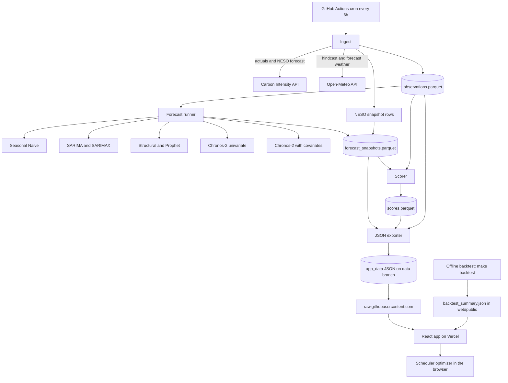

# Design Document: GreenWindow — Carbon-Aware Job Scheduler

> **Working name:** GreenWindow
> **One-line pitch:** *"When is the cleanest time to run my electricity-hungry job in the next 48 hours, and how sure are we?"*
> **Status:** Draft v0.3 for review. Requirements are embedded in Section 1 (no separate PRD yet). v0.2 added Section 14 (feasibility gate) and Section 15 (human prerequisites). **v0.3 replaces the Streamlit front end with a React app on Vercel** (Sections 3, 4, 6.7, 6.8, 7.6, 10, 11, 12, 14, 15 changed). Course-alignment changes (Prophet, UCM, factor covariates) are proposed but not yet applied.
> **Date:** 2026-10-05

## How to use this document

- **You (the student):** Review Sections 1, 3, and 13 (goals, decisions, open questions). Do the actions in Sections 14 and 15 *before* handing the build to an agent. The rest is for the build.
- **AI coding agent:** Read Sections 2 to 12 in order. Section 11 is the task list. Section 12 contains the rules to copy into `AGENTS.md`. Do not invent endpoints, parameters, or library signatures. Anything under **"Verify during build"** (Section 2.2) must be checked against live docs or the installed package before use.
- **Traceability:** Requirements are numbered `R1…`. Tasks in Section 11 cite the requirements they satisfy.

---

## 1. Overview

### 1.1 Problem

Electricity's carbon intensity (gCO₂ per kWh) in Great Britain swings by a factor of 2 to 4 within days, driven mainly by wind, solar, and demand. A flexible load (EV charging, batch compute, a washing cycle, building pre-cooling) can cut its emissions by running in a cleaner window. Choosing that window requires a **forecast with honest uncertainty**, not a point estimate.

### 1.2 What the project is

A live, self-updating web app that:

1. Forecasts GB grid carbon intensity hourly for the next 48 hours using **classical models and a time-series foundation model** (Chronos-2), with and without weather covariates.
2. Turns the forecast into a **scheduling recommendation** for a user-defined job (duration, power draw, deadline).
3. **Scores itself continuously** against actuals as they arrive, including against the grid operator's own published forecast, producing a live model leaderboard.

### 1.3 Roles this demonstrates

Energy/load planner, operations analyst, sustainability analyst. The forecast → decision → self-evaluation loop is the transferable skill.

### 1.4 Goals

| ID | Requirement | Priority |
|----|-------------|----------|
| R1 | Ingest GB national carbon intensity (actual + operator forecast) and weather (temperature, wind, solar radiation) from free, keyless APIs | Must |
| R2 | Provide at least these models behind one interface: Seasonal Naive (24h and 168h), ETS, SARIMAX with weather covariates, Chronos-2 univariate, Chronos-2 with covariates | Must |
| R3 | All models output a 48-step hourly forecast with quantiles (P10, P50, P90) | Must |
| R4 | A reproducible rolling-origin backtest comparing all models, with MAE, RMSE, MASE, weighted quantile loss, and 80% interval coverage, sliced by horizon | Must |
| R5 | A scheduled pipeline (every 6 hours) that refreshes data, issues forecasts, stores immutable forecast snapshots, and scores past snapshots against actuals | Must |
| R6 | A public **React (TypeScript) web app**, mobile-friendly, with: forecast view with model toggle, scheduler tool, live leaderboard, backtest results, "About & Limitations" page | Must |
| R7 | The scheduler recommends a start time for a job and reports expected savings vs. "run now" with a robustness flag | Must |
| R8 | A Data Card page documenting sources, licenses, and biases, visible inside the app | Must |
| R9 | Runs on CPU, zero paid services, deployable from a single GitHub repo | Must |
| R10 | Gradient-boosting model (LightGBM) with lag and weather features | Should |
| R11 | Diebold-Mariano or paired-bootstrap significance test on backtest results | Could |
| R12 | "Weather scenario" slider that perturbs future wind to show covariate sensitivity (labeled as sensitivity, not causal) | Could |
| R13 | Electricity price overlay (e.g., a free UK dynamic tariff API) | Won't (v1) |

### 1.5 Non-goals

- Not a production system. No SLA, auth, or user accounts.
- Not regional or sub-national forecasting (national GB only in v1).
- Not marginal-emissions modeling (see 5.3, "average vs. marginal").
- No fine-tuning of Chronos-2. Zero-shot only, so classical models remain the main modeling story.
- No streaming or websockets. Refresh is periodic.
- No claims of beating the operator's forecast. The result is reported whichever way it falls.

### 1.6 Success criteria (the prototype is "done" when)

1. `make backtest` reproduces the results table from a clean clone in under 30 minutes on a laptop CPU.
2. The scheduled workflow has run successfully for 7 consecutive days with no manual intervention.
3. The leaderboard shows at least 7 days of live scored forecasts for every model.
4. A stranger can open the public URL, set a job, and get a recommendation in under 60 seconds.
5. README states what was found, including at least one honest negative result.

---

## 2. Research Findings

### 2.1 Verified during spec writing

| Topic | Finding | Source |
|-------|---------|--------|
| Carbon Intensity API | Official NESO API for Great Britain; base URL `https://api.carbonintensity.org.uk`; `/intensity` returns `from`, `to`, and `intensity.{forecast, actual, index}` | carbonintensity.org.uk; publicapi.dev listing |
| Forecast horizon | NESO states forecasts run 96+ hours ahead; a 48-hour window is the standard "forward" view | carbonintensity.org.uk |
| Actual vs forecast | `actual` is not set for future periods | Third-party client docs (pkg.go.dev wrapper) |
| License | API licensed CC BY 4.0 (attribution required) | carbonintensity.org.uk |
| Nature of the data | Carbon intensity covers generation-related CO₂ and is an *indicative, modeled* estimate, not a metered value | carbonintensity.org.uk |
| Open-Meteo | No API key, no sign-up; free tier is for **non-commercial** use, ~10,000 calls/day; data under CC BY 4.0 | open-meteo.com |
| Open-Meteo history | ERA5 reanalysis from 1940; **Historical Forecast archive from 2021** in the same format as the live Forecast API | open-meteo.com |
| Chronos-2 | 120M-parameter encoder-only foundation model; zero-shot; supports univariate, multivariate, past-only covariates, and known-future covariates; outputs quantile forecasts; `pip install "chronos-forecasting>=2.0"`; entry point `Chronos2Pipeline.from_pretrained("amazon/chronos-2")` and `pipeline.predict_df(...)` | Hugging Face model card; GitHub README |
| Chronos family note | The *original* Chronos is built on language-model architectures; Chronos-2 is encoder-only. Confirm with the instructor that "foundation model" use is allowed | GitHub README |
| raw.githubusercontent.com | Serves files with CORS headers (`access-control-allow-origin: *`), so a browser app can read a public repo's files with a plain GET; it sits behind a cache that refreshes about every 300 seconds and does not honor cache-control request headers or CORS preflights | Community reports (not GitHub docs directly) |
| Vercel Hobby plan | Free, but restricted to personal, non-commercial use (fine for a portfolio; do not add ads, payments, or client work) | Vercel docs and fair-use guidelines |
| GitHub Actions schedules | Scheduled workflows in public repos are auto-disabled after 60 days without repo activity; runs can be delayed by 15 to 60+ minutes under load, and the top of the hour is the most congested slot | Community and monitoring-vendor reports (not GitHub docs directly) |
| Supabase free tier (rejected alternative, Section 15.1) | 500 MB database, 2 free projects, projects pause after 7 days of inactivity and must be restored manually | Third-party 2026 pricing guides; confirm on supabase.com/pricing |
| Streamlit on Vercel (why the front end is React, Section 15.1) | Streamlit needs a long-lived server with persistent connections. Vercel Functions are request/response; native WebSocket support is a recent beta and connections are pinned to a function's maximum duration. Do not plan around Streamlit-on-Vercel | Vercel KB and community reports |

### 2.2 Verify during build (do not assume)

| # | Item | How to verify |
|---|------|---------------|
| V1 | Carbon Intensity endpoints for a date range (`/intensity/{from}/{to}`) and the 48h forward view (`/intensity/{from}/fw48h`), plus the **maximum date range per request** (believed ~14 days) | Fetch the OpenAPI docs at `api.carbonintensity.org.uk`. **Verified 2026-10-05 (T-1):** both endpoints work; ranges up to 30 days accepted, 31+ days rejected ("greater than 31 days"). Chunk at 30 days. fw48h returned 96 half-hours |
| V2 | Whether the `forecast` values returned for *past* periods have a defined lead time (suspected: no) | Read docs; compare stored snapshots vs. the later-returned values |
| V3 | Exact Open-Meteo host and parameters for the **Historical Forecast API** | open-meteo.com/en/docs/historical-forecast-api. **Verified 2026-10-05 (T-1):** `https://historical-forecast-api.open-meteo.com/v1/forecast` with `latitude`/`longitude` (comma lists for multiple points), `hourly`, `start_date`, `end_date`, `timezone=UTC`, `wind_speed_unit=ms` |
| V4 | Open-Meteo variable names: `temperature_2m`, `wind_speed_100m`, `shortwave_radiation` | open-meteo.com/en/docs. **Verified 2026-10-05 (T-1):** all three exist on both APIs; units °C, m/s (with `wind_speed_unit=ms`), W/m² |
| V5 | `Chronos2Pipeline.predict_df` argument names (context df, future covariates df, `prediction_length`, `quantile_levels`, id/timestamp/target column names) in the **installed** version | `help(Chronos2Pipeline.predict_df)` after install. **Verified 2026-10-05 (T-1), chronos-forecasting 2.3.2:** `predict_df(df, future_df=None, id_column='item_id', timestamp_column='timestamp', target='target', prediction_length=None, quantile_levels=[0.1..0.9], batch_size=256, context_length=None, cross_learning=False, validate_inputs=True, freq=None)`. Output columns: `id, timestamp, target_name, predictions, '0.1', '0.5', '0.9'`. Covariates = extra columns in `df`; known-future ones are repeated in `future_df` |
| V6 | GitHub Actions scheduling. **Partly verified** (60-day auto-disable and delays confirmed by secondary sources). **Still open:** whether bot commits to the `data` branch count as "activity". Assume they do not and add a keepalive that uses the Actions API | GitHub docs "Events that trigger workflows → schedule" |
| V7 | Hosting: current Vercel Hobby limits (transfer, builds), the Vite framework preset, and the `Root Directory = web` setting; GitHub Pages as fallback host | Official Vercel docs |
| V8 | Chronos-2 CPU inference time and memory for a ~28-day hourly context | Measure in task T7. **Gate measurement 2026-10-05 (laptop CPU, torch 2.8.0):** load 11 s, +513 MB RSS, warm 48h forecast on 672h context 0.07 s univariate / 0.13 s with covariates |
| V9 | Browser access to `raw.githubusercontent.com` on the `data` branch: CORS header present, refresh lag, behavior under repeated polling. Fallback: GitHub Pages serving the same JSON | Feasibility check E4; manual test in T-1b |
| V10 | Current stable versions and APIs of Node, Vite, React, Recharts (including range-area support for the P10 to P90 band), zod, TanStack Query, Vitest | Package docs at build time; pin in `package.json` and lockfile |
| V11 | How to stop Vercel from building on every push to the `data` branch (project Git settings, `vercel.json` `git.deploymentEnabled`, or Ignored Build Step) | Vercel docs; confirm in the Deployments tab after the first pipeline run. **Verified 2026-10-06:** `web/vercel.json` with `git.deploymentEnabled.data = false`, committed on both `main` and `data`; pipeline commit `aa9da9d` on `data` produced no Vercel deployment or commit status, while `main` deployed to production |

---

## 3. Key Decisions

### Decision D1: Geography and target

**Context:** UK vs. US data was left open.
**Options:** (1) GB Carbon Intensity API, no key, official forecast to benchmark. (2) US EIA hourly demand, needs a free key, no official forecast to compare against.
**Decision:** GB national carbon intensity.
**Rationale:** Keyless, built-in benchmark, strong seasonality, clean decision story.
**Implications:** Output is only valid for GB. State this everywhere.

### Decision D2: Resolution and horizon

**Context:** Source data is half-hourly; weather is hourly.
**Options:** (1) 30-minute model. (2) Hourly model.
**Decision:** Hourly (aggregate half-hours to the hourly mean), horizon 48 steps.
**Rationale:** Matches weather resolution, halves the compute, and scheduling a job to the hour is realistic. Seasonal period is 24 (daily) and 168 (weekly).
**Implications:** All timestamps are **hour-beginning, UTC**. Convert to `Europe/London` only in the UI.

### Decision D3: Weather inputs must match train and serve

**Context:** Open-Meteo offers ERA5 *reanalysis* (what actually happened) and *forecast* data. Training on reanalysis and predicting with forecasts creates train/serve skew.
**Options:** (1) ERA5 for history, forecast API for the future. (2) Historical Forecast API for history, forecast API for the future.
**Decision:** Option 2. **Never use the ERA5 archive as model input.**
**Rationale:** Past covariates then come from the same kind of product as live covariates.
**Implications:** History starts at 2021 at the earliest. The backtest still uses hindcast weather that is *better* than a true 24–48h-ahead forecast; this optimism is a documented bias (5.3). The live leaderboard is the unbiased check.

### Decision D4: Where the weather is sampled

**Decision:** Four fixed points defined in `config/locations.yaml` (e.g., London, Birmingham/Manchester area, Edinburgh/Glasgow area, and one northern/offshore-wind-relevant point), combined with fixed weights into three national features: temperature, 100m wind speed, shortwave radiation.
**Rationale:** Wind and solar generation drive intensity; a single city would miss Scotland's wind fleet.
**Implications:** Weights are a documented simplification, not an optimized choice. Pick the coordinates during T1 and record them in the Data Card.
**Amended 2026-10-07:** seven points (three more offshore wind points), plus a fourth derived feature `wind_cf`: a generic turbine power curve applied to each point's 100m wind speed, then weighted. Models use `wind_cf` instead of `wind100`. See `docs/decisions.md`.

### Decision D5: Forecast snapshots are immutable

**Decision:** Every pipeline run appends rows to `forecast_snapshots` with `issued_at_utc`. Rows are never edited or deleted (except by the retention rule).
**Rationale:** Honest live scoring needs the forecast as it was *at issue time*. This also provides the operator-forecast "vintage" history that the API does not expose (V2).

### Decision D6: Storage, compute, and how the app gets data

**Context:** The front end is a static React app with no backend. The pipeline does all forecasting.
**Options:**
1. Commit data to `main`. Simple, but history bloats.
2. Orphan `data` branch holding internal parquet files **plus small JSON exports** that the browser reads through `raw.githubusercontent.com`.
3. Supabase Postgres. Adds an account, a secret, and a free tier that pauses after 7 days of inactivity.
4. Hugging Face Dataset repo. Adds token plumbing.

**Decision:** Option 2. Retention: 120 days of snapshots and scores; all hourly observations (small). The app reads **only** `app_data/*.json` (Section 7.6).
**Rationale:** Zero secrets, no extra accounts, nothing that can pause. The raw host sends CORS headers and caches about 5 minutes, which is ample for a 6-hour refresh (V9).
**Implications:** The JSON files are a versioned contract (D12). Supabase is rejected for v1 because a static file does the same job; it would make sense only if you later add user accounts or saved jobs.

### Decision D7: Classical libraries

**Decision:** `statsmodels` (ETS via `ExponentialSmoothing`/`ETSModel`, `SARIMAX`) rather than a higher-level package.
**Rationale:** Matches what a time-series course teaches and is easy to explain in an interview.
**Implications:** Fitting is slower than specialized libraries, so use a bounded training window (D8) and fixed model orders.

### Decision D8: Equal information for every model

**Decision:** All models see the same trailing window: **56 days (1,344 hourly points)** for classical models, and the **last 28 days (672 points)** as Chronos-2 context by default. Both are config values and are tested in the backtest as a sensitivity check.
**Rationale:** A fair comparison. Window sizes are tunable parameters, not hidden advantages.

### Decision D9: Scheduling under uncertainty

**Decision:** The optimizer ranks candidate start times by mean of P50 over the job window. A start is flagged **robust** only if the candidate window's *average P90* is below the *run-now window's average P10*.
**Rationale:** Simple, explainable, and conservative.
**Implications:** Averaging quantiles across hours implicitly assumes perfectly correlated errors, which overstates the width of the uncertainty. This is intentionally conservative and must be stated in the UI help text.

### Decision D10: Front-end stack

**Context:** The owner wants a React app, deployable on Vercel.
**Options:**
1. Next.js. Server rendering is not needed for a data dashboard, and it adds functions, runtime limits, and complexity.
2. **Vite + React + TypeScript (strict), built to a static site.**
3. Streamlit. Rejected: the owner prefers React, and it cannot be hosted on Vercel's serverless platform.

**Decision:** Option 2, deployed to **Vercel Hobby** (GitHub Pages as fallback). Charts: Recharts (confirm range-area support, V10). Data fetching: TanStack Query. Validation: zod. Styling: Tailwind CSS. Tests: Vitest and Testing Library.
**Rationale:** Smallest moving parts that still feel like a real product. The output is static files on a CDN: no servers, no secrets, no cold starts.
**Implications:** Hobby is for personal, non-commercial use. This is a portfolio project, so it is fine. Do not add ads, payments, or client work. Pin exact versions at build (V10).

### Decision D11: Scheduler logic lives only in the front end

**Context:** The recommendation depends on user inputs (duration, power, deadline), so it cannot be precomputed.
**Decision:** One implementation, in TypeScript (`web/src/scheduler/optimizer.ts`), run in the browser. Python never needs it.
**Rationale:** Avoids duplicate logic in two languages.
**Implications:** Correctness rests on golden test cases stored as JSON fixtures (Section 10.4).

### Decision D12: The JSON export is the only interface between pipeline and app

**Decision:** The app reads only the JSON files in 7.6. Every file carries `schema_version`. A breaking change bumps the major version, and the app refuses to render a mismatched major version with a clear message.
**Rationale:** Decouples the Python and TypeScript halves so each can be built and tested alone. It also gives the AI agent one precise contract.
**Implications:** Both sides validate against the same fixtures (cross-language contract test).

---

## 4. Architecture

### 4.1 System overview

A scheduled GitHub Actions pipeline does all the heavy work. It stores internal parquet files and publishes small JSON exports on the `data` branch. A static React app, hosted on Vercel, reads those JSON files straight from GitHub and renders the forecast, scheduler, and leaderboard. There is no always-on backend and no database.



### 4.2 Data flow in one pipeline run

1. Fetch the last 7 days of actuals and refresh (overwrite) them, since actuals may be revised.
2. Fetch the NESO 48h forward forecast; store as snapshot rows with `model="neso"`.
3. Fetch weather: hindcast for the past, forecast for the next 48+ hours.
4. Build the model inputs. Run each model. Validate output. Append snapshot rows.
5. Score every snapshot row whose target hour now has an actual. Rewrite `scores.parquet` idempotently.
6. **Export** the JSON files (7.6). Validate each against its schema. Write all of them atomically (all or none).
7. Apply retention. Commit parquet and JSON to the `data` branch in one commit.

### 4.3 Technology stack

| Layer | Choice | Notes |
|-------|--------|-------|
| Pipeline language | Python 3.11 | |
| Env/lock | `uv` with lockfile | Pin exact versions at build time |
| Data | `pandas`, `pyarrow` | |
| HTTP | `httpx` or `requests` with retries | |
| Validation (Python) | `pandera` (or `pydantic`) | Parquet schemas and JSON export |
| Classical | `statsmodels` (plus Prophet if the course alignment is adopted) | D7 |
| Foundation model | `chronos-forecasting>=2.0`, CPU `torch` | Cache model weights in CI |
| Optional ML | `lightgbm` | R10 |
| Calendar | `holidays` (UK) | Bank-holiday covariate |
| Front end | Node 20 or newer, Vite, React, TypeScript (strict) | D10; pin versions (V10) |
| Charts, data, validation | Recharts, TanStack Query, zod | |
| Styling | Tailwind CSS | |
| Quality | `pytest`, `ruff` (Python); Vitest, Testing Library, ESLint (web) | |
| CI/CD | GitHub Actions (pipeline, tests); Vercel Git integration (deploy) | |
| Hosting | Vercel Hobby (fallback: GitHub Pages) | V7 |

### 4.4 Branch and repository layout

**`data` branch** (orphan; written only by the pipeline):

```
data
├── parquet/
│   ├── observations.parquet
│   ├── forecast_snapshots.parquet
│   └── scores.parquet
└── app_data/                      # the public contract, spec 7.6
    ├── meta.json
    ├── latest_forecast.json
    ├── recent_observations.json
    └── leaderboard.json
```

**`main` branch:**

```
greenwindow/
├── AGENTS.md
├── README.md
├── Makefile                  # setup, test, backtest, pipeline, export, web-dev, web-build
├── pyproject.toml
├── config/
│   ├── settings.yaml         # horizon, windows, quantiles, retention, cron minute
│   └── locations.yaml        # weather points + weights
├── src/greenwindow/
│   ├── ingest/               # carbon.py, weather.py, build_observations.py
│   ├── features/             # calendar.py, covariates.py
│   ├── models/               # base.py, naive.py, sarima.py, sarimax.py, ucm.py, chronos2.py, ...
│   ├── backtest/             # runner.py, metrics.py, summary.py
│   ├── live/                 # pipeline.py, scorer.py, retention.py
│   ├── export/               # app_json.py (writes 7.6 files)
│   └── schemas.py
├── web/
│   ├── package.json, vite.config.ts, tsconfig.json, tailwind config, index.html
│   ├── public/
│   │   └── backtest_summary.json     # produced by `make backtest`, committed (changes rarely)
│   └── src/
│       ├── main.tsx, App.tsx
│       ├── data/             # client.ts, schemas.ts (zod), hooks.ts
│       ├── scheduler/        # optimizer.ts, optimizer.test.ts
│       ├── components/       # ForecastChart, ModelPicker, StaleBanner, JobForm,
│       │                     # RecommendationCard, LeaderboardTable, Attribution
│       ├── pages/            # Home, Scheduler, Leaderboard, Backtest, About
│       └── lib/              # time.ts (Europe/London display), format.ts
├── tests/
│   ├── fixtures/             # recorded API responses (Python)
│   ├── app_data/             # shared JSON contract fixtures: Python writes them, web tests parse them
│   └── golden/               # optimizer_cases.json, read by Vitest
├── notebooks/                # exploration only; nothing imports from here
├── docs/
└── .github/workflows/
    ├── pipeline.yml          # cron + workflow_dispatch + keepalive
    └── ci.yml                # Python and web lint/tests on PR
```

---

## 5. Data Card

### 5.1 Sources

| Source | Used for | Access | License / terms |
|--------|----------|--------|-----------------|
| NESO Carbon Intensity API (GB) | Target (`actual`), benchmark (`forecast`) | No key | CC BY 4.0; attribute NESO |
| Open-Meteo Historical Forecast API | Past weather covariates | No key | CC BY 4.0 data; free tier non-commercial |
| Open-Meteo Forecast API | Future weather covariates | No key | Same |
| `holidays` package (UK) | Bank-holiday flag | Library | Open source |

Raw API payloads are **not** committed. Only derived hourly parquet files are stored.

### 5.2 Fields

See Section 7 for exact schemas. Target: `ci_actual` (gCO₂/kWh, hourly mean). Covariates: `temp_c`, `wind100_ms` (or km/h as returned; **record the unit and convert once, in ingest**), `solar_wm2`, `is_bank_holiday`, `hour_of_day`, `day_of_week`.

### 5.3 Known biases and limitations (must appear in the app)

1. **Modeled target.** `ci_actual` is the operator's estimate, not a meter reading. Models learn the operator's methodology.
2. **Average vs. marginal.** The metric is *average* carbon intensity. Shifting load to a low-average hour does not guarantee the same reduction in *marginal* emissions. The app must not claim "you saved X kg of CO₂"; it must say "estimated reduction in the grid's average intensity for your job window."
3. **Optimistic backtest weather.** Backtest covariates come from hindcast data that are closer to reality than a true 24–48h-ahead forecast. Covariate models therefore look better in the backtest than they will live. The live leaderboard corrects this.
4. **Possible pretraining overlap.** Chronos-2 may have seen similar electricity or carbon series during pretraining. The backtest cannot rule out leakage; only live (genuinely future) scoring can.
5. **Regime drift.** The GB grid is decarbonizing. A level shift or changing coal/gas/wind mix breaks stationarity. Short training windows (D8) limit but do not remove the problem.
6. **Single country.** Findings do not transfer to other grids.
7. **Operator forecast vintage.** Past `forecast` values returned by the API may have undefined lead times (V2). Backtest comparisons against NESO are labeled "NESO as published, lead time unknown" and are not treated as a fair head-to-head. Only live snapshots are.
8. **Weather aggregation.** Four fixed points with fixed weights are a simplification of the real spatial distribution of wind and solar.
9. **Revisions.** Recent actuals can change. The scorer re-reads the latest 7 days each run and rescoring is idempotent.
10. **Weather API terms.** Free tier is non-commercial; this is a portfolio project. Do not monetize without a paid plan.

---

## 6. Components and Interfaces

### 6.1 Ingest

**Purpose:** Fetch, normalize, and merge source data into one hourly table.

```python
def fetch_carbon_actuals(start: datetime, end: datetime) -> pd.DataFrame
    """Half-hourly. cols: from_utc, ci_actual, ci_forecast_published. Chunks requests to API max range (V1)."""

def fetch_neso_forward_forecast(now: datetime) -> pd.DataFrame
    """Next ~48h half-hourly NESO forecast. cols: from_utc, ci_forecast."""

def fetch_weather(kind: Literal["hindcast", "forecast"], start, end, locations) -> pd.DataFrame
    """Hourly per location. Raises on missing variables."""

def build_observations(carbon_hh, weather_hourly, locations_cfg) -> pd.DataFrame
    """Aggregates to hourly, applies weights, adds calendar features. Returns schema OBSERVATIONS."""
```

**Rules:**
- All timestamps UTC, hour-beginning, timezone-aware.
- Hourly `ci_actual` = mean of the two half-hours. If only one half-hour exists, use it and set `n_halfhours=1`. If none, `NaN`.
- Retry on 429/5xx with exponential backoff (max 4 tries). A fixed user-agent string identifying the project.

### 6.2 Forecaster interface

```python
class Forecaster(Protocol):
    name: str                      # unique, used as snapshot `model` key
    uses_covariates: bool

    def forecast(
        self,
        history: pd.DataFrame,                 # index: ts_utc; cols: ci_actual + covariates; NO rows >= origin
        future_covariates: pd.DataFrame | None,  # index: next `horizon` hours; None if not uses_covariates
        horizon: int,                           # 48
        quantiles: Sequence[float],             # [0.1, 0.5, 0.9]
    ) -> pd.DataFrame:
        """Index: horizon timestamps. Columns: 'mean', 'q0.1', 'q0.5', 'q0.9'."""
```

**Model registry**

| `name` | Method | Covariates | Interval method |
|--------|--------|------------|-----------------|
| `snaive_24` | Value 24h earlier | No | Empirical residual quantiles of 24h differences in the window |
| `snaive_168` | Value 168h earlier | No | Same, using 168h differences |
| `ets` | Additive ETS with 24h seasonality (fixed spec) | No | Model prediction intervals (simulation or analytic) |
| `sarimax_wx` | SARIMAX with Fourier or dummy seasonality plus weather and holiday regressors (fixed order from course material) | Yes | Model prediction intervals |
| `chronos2_uni` | Chronos-2 zero-shot, target only | No | Native quantiles |
| `chronos2_cov` | Chronos-2 zero-shot, past and known-future covariates | Yes | Native quantiles |
| `lgbm_wx` (R10) | LightGBM direct multi-horizon on lags and weather | Yes | Quantile objectives |

**Contract tests every model must pass** (see Section 10): correct index, no NaN, quantiles monotonic non-decreasing, no use of rows at or after the origin.

### 6.3 Chronos-2 adapter

- Load once per process. Weights cached via `actions/cache` in CI.
- Convert `history` and `future_covariates` into the long-format dataframe that `predict_df` expects. **Confirm the signature first (V5).**
- Past-only covariates (e.g., observed weather in the context) and known-future covariates (weather forecast, calendar) are distinguished by what is supplied for the future window.
- Measure CPU time and memory for the default context (V8). If a run exceeds 10 minutes in CI, reduce context length and record the change.

### 6.4 Backtest runner

```python
def run_backtest(observations, models, origins, horizon=48) -> pd.DataFrame
    """For each origin: slice history strictly before origin; take true hindcast weather as 'future covariates'; run each model; return long format (schema BACKTEST)."""
```

- **Origins:** daily at 00:00 UTC for the last 90 days of data, ending at least 48h before the latest actual.
- **Training window:** per D8, rolling (not expanding).
- Classical models refit at every origin.
- Parallelize across origins only if results stay deterministic.
- Seed everything. Persist results to `backtest_results.parquet`.

### 6.5 Metrics

```python
def mae(y, yhat) -> float
def rmse(y, yhat) -> float
def mase(y, yhat, y_train_window, m=24) -> float   # scale: in-sample seasonal-naive MAE
def pinball(y, q_pred, tau) -> float
def wql(y, q_preds: dict[float, array]) -> float   # mean pinball over quantile levels, scaled by sum(|y|)
def coverage(y, lo, hi) -> float                   # target 0.80 for P10–P90
```

Report overall and **by horizon bucket**: 1–6h, 7–24h, 25–48h. Also report by hour-of-day and by wind tercile (to expose regime-specific failures).

### 6.6 Live pipeline and scorer

```python
def run_pipeline(now: datetime) -> RunReport
    """Steps in 4.2. Idempotent for a given `run_id` (hash of issued_at hour). Never raises on a single model failure."""

def score_snapshots(snapshots, observations) -> pd.DataFrame
    """Joins on target_ts; computes abs_err and pinball per quantile; idempotent."""
```

- `run_id` = `YYYYMMDDTHH` of the issue hour (UTC). Re-running the same hour replaces that run's rows, which is the **only** permitted rewrite.
- If one model fails, log it, write a `RunReport` entry, and continue with others.
- Leaderboard: rolling 14-day MAE and WQL per model per horizon bucket, computed from `scores.parquet`.

### 6.7 Scheduler optimizer (TypeScript, runs in the browser)

File: `web/src/scheduler/optimizer.ts`. Pure functions, no network, no DOM.

```ts
export interface HourForecast { ts: string; q10: number; q50: number; q90: number } // ts: ISO-8601 UTC, hour-beginning

export interface JobSpec {
  durationH: number;      // integer, 1..12
  powerKw: number;        // > 0
  earliestStart: string;  // ISO UTC; must be >= first forecast hour
  deadline: string;       // ISO UTC; job must END by this; <= last forecast hour + 1h
}

export type Mode = "expected" | "cautious";

export interface Candidate { start: string; avgQ10: number; avgQ50: number; avgQ90: number }

export interface Recommendation {
  bestStart: string;
  runNowStart: string;            // = earliestStart
  avgIntensityBest: number;       // gCO2/kWh, mean of q50 over the best window
  avgIntensityNow: number;        // same for the run-now window
  energyKwh: number;              // durationH * powerKw
  intensityReductionPct: number;  // (now - best) / now * 100, never negative
  gramsDifference: number;        // energyKwh * (now - best)
  robust: boolean;                // best window's avg q90 < run-now window's avg q10
  candidates: Candidate[];        // every feasible start
}

export class InfeasibleJobError extends Error {}
export function recommend(forecast: HourForecast[], job: JobSpec, mode: Mode): Recommendation;
```

**Rules**
- A candidate start is every whole hour `s` such that `earliestStart <= s` and `s + durationH <= deadline`, with all hours present in the forecast. Missing hours make a candidate infeasible.
- `expected` ranks candidates by `avgQ50`; `cautious` ranks by `avgQ90`. Ties go to the earliest start.
- If there is no feasible candidate, throw `InfeasibleJobError`.
- If the best window is no better than run-now, return `intensityReductionPct = 0` and `bestStart = runNowStart` (no change recommended).
- UI wording rule: say "estimated difference in average grid intensity." Never "CO2 saved" (see 5.3 item 2).
- Averaging quantiles across hours implicitly assumes perfectly correlated errors, which is conservative (Decision D9). The About page must say so.

### 6.8 React app

**Behavior, not just layout.** The app fetches the JSON files (7.6), validates them with zod, and renders. It performs no model inference and calls no API other than those files.

| Page | Content |
|------|---------|
| Home | Pitch, "last updated" time, current intensity, next-48h chart with a model selector and a P10 to P90 band, NESO forecast as a dashed line, a "now" marker, and an optional second-model overlay to show disagreement |
| Scheduler | Job form (duration, kW, deadline, mode) with validation; recommendation card with best start, reduction, grams difference, and a **robust / not robust** badge; chart of candidate windows with the best window highlighted; plain-language caveat |
| Leaderboard | Rolling 14-day scores by model and horizon bucket from `leaderboard.json`; "n scored forecasts" shown beside every number |
| Backtest | Table and plots from `backtest_summary.json`, with the optimism caveat (5.3 item 3) visible next to the numbers |
| About and Limits | Data Card summary, methodology, bias list, links to sources, attribution to NESO and Open-Meteo (CC BY 4.0) |

**Data layer**
- `client.ts` fetches from `import.meta.env.VITE_DATA_BASE_URL` (a public value, not a secret) with plain GET requests: **no custom request headers** (they would trigger a CORS preflight that the raw host does not answer, see V9).
- TanStack Query with `staleTime` of 15 minutes and refetch on window focus. One retry with backoff.
- Every response passes through the zod schema for its file. A failed parse shows an error panel naming the file; the app never renders partial or unvalidated data.
- `schema_version` major mismatch shows "This page needs an update" instead of rendering.

**Time handling**
- All data is UTC. Convert to `Europe/London` only at render time with `Intl.DateTimeFormat`. Test the two clock-change days.

**UX and quality rules**
- Mobile first (works at 360 px width); keyboard accessible; sufficient contrast; the P10 to P90 band is distinguishable without color alone (pattern or outline); light and dark themes.
- Show "Data last updated: <time>" on every page. Show a stale-data banner if `generated_at_utc` is older than 12 hours.
- Loading skeletons and explicit empty and error states for every fetch.
- Bundle budget: under 400 KB gzipped for the initial JS.
- No analytics or third-party scripts in v1.

---

## 7. Data Models

All files are parquet on the `data` branch. Validate with `pandera` on read and write.

### 7.1 `observations.parquet`

**Purpose:** Hourly truth and covariates. One row per hour.

| Field | Type | Required | Description |
|-------|------|----------|-------------|
| ts_utc | datetime64[ns, UTC] | Yes | Hour-beginning, unique, sorted |
| ci_actual | float | No | gCO₂/kWh, hourly mean; NaN if missing |
| n_halfhours | int8 | Yes | 0, 1, or 2 |
| temp_c | float | Yes | Weighted national temperature (hindcast) |
| wind100 | float | Yes | Weighted 100m wind speed; unit recorded in config |
| wind_cf | float | Yes | Weighted wind capacity factor in [0, 1]: power curve per point, then weighted (added 2026-10-07) |
| solar_wm2 | float | Yes | Weighted shortwave radiation |
| is_bank_holiday | bool | Yes | England-and-Wales bank holiday flag (document choice) |

**Validation:** `ts_utc` unique and strictly increasing; hourly frequency with no gaps (gaps become explicit NaN rows); `ci_actual` in `[0, 600]` else flagged; weather within physical bounds.

### 7.2 `forecast_snapshots.parquet`

**Purpose:** Immutable log of every forecast as issued.

| Field | Type | Required | Description |
|-------|------|----------|-------------|
| run_id | string | Yes | `YYYYMMDDTHH` |
| issued_at_utc | datetime | Yes | Issue hour (UTC) |
| model | string | Yes | Registry `name`, or `neso` |
| target_ts_utc | datetime | Yes | Hour being forecast |
| horizon_h | int | Yes | 1..48 |
| mean | float | No | Point forecast |
| q10, q50, q90 | float | No | NULL for `neso` (point only; `q50 = mean`) |

**Key:** `(run_id, model, target_ts_utc)` unique.

### 7.3 `scores.parquet`

| Field | Type | Description |
|-------|------|-------------|
| run_id, model, target_ts_utc, horizon_h | as above | Key |
| actual | float | Latest known actual |
| abs_err | float | `|q50 or mean − actual|` |
| sq_err | float | Squared error of the point forecast |
| pin10, pin50, pin90 | float | Pinball losses; NULL for `neso` |
| in_80 | bool | actual within `[q10, q90]`; NULL for `neso` |

### 7.4 `backtest_results.parquet`

Same columns as snapshots plus `actual`, with `origin_utc` replacing `run_id`, and `train_window_h`, `context_h`.

### 7.5 Example snapshot row

```json
{"run_id": "20261005T06", "issued_at_utc": "2026-10-05T06:00:00Z", "model": "chronos2_cov",
 "target_ts_utc": "2026-10-05T18:00:00Z", "horizon_h": 12,
 "mean": 142.3, "q10": 101.8, "q50": 139.9, "q90": 188.6}
```

### 7.6 Public JSON contract (pipeline to app)

These files live in `app_data/` on the `data` branch (and `backtest_summary.json` in `web/public/`). They are the **only** interface the app uses (Decision D12). The Python exporter writes them; the web app validates them with zod. Both are tested against the same fixtures in `tests/app_data/`.

**Global rules:** every file has an integer `schema_version` (starts at 1) and `generated_at_utc`. Timestamps are ISO-8601 UTC with a trailing `Z`, hour-beginning. Numbers are rounded to 1 decimal. Missing values are `null`, never `NaN` or empty strings. Each file stays under 300 KB. All files in a run are written together.

**`meta.json`**

| Field | Type | Description |
|-------|------|-------------|
| schema_version | int | 1 |
| generated_at_utc | string | When the pipeline run finished |
| latest_run_id | string | Matches `run_id` in 7.2 |
| latest_actual_ts_utc | string or null | Most recent hour with an actual |
| models | array | `{name, label, family, uses_covariates}`; `family` is `"benchmark"`, `"classical"`, or `"foundation"` |
| attribution | array of string | Required credit lines (NESO, Open-Meteo) |

**`latest_forecast.json`**

| Field | Type | Description |
|-------|------|-------------|
| schema_version, generated_at_utc | | As above |
| run_id, issued_at_utc | string | The forecast run |
| horizon | int | 48 |
| series | array | One entry per model: `{model, points: [{ts, mean, q10, q50, q90}]}`; quantiles are `null` for the NESO benchmark; each `points` array has exactly `horizon` items |

**`recent_observations.json`**: `{schema_version, generated_at_utc, points: [{ts, ci_actual, temp_c, wind100, solar_wm2}]}`, last 7 days, hourly.

**`leaderboard.json`**

| Field | Type | Description |
|-------|------|-------------|
| window_days | int | 14 |
| rows | array | `{model, horizon_bucket, n_scored, mae, rmse, wql, coverage80}`; `horizon_bucket` is `"1-6"`, `"7-24"`, or `"25-48"`; `wql` and `coverage80` are `null` for the NESO benchmark |
| n_runs | int | Number of distinct scored runs in the window |

**`backtest_summary.json`**: `{schema_version, generated_at_utc, origins: {start, end, count}, caveat: string, rows: [{model, horizon_bucket, mase, mae, wql, coverage80}], sensitivity: [{setting, value, model, mase}]}`. Produced by `make backtest` and committed; changes rarely.

**Example `latest_forecast.json` (abridged)**

```json
{"schema_version": 1, "generated_at_utc": "2026-10-05T06:21:00Z",
 "run_id": "20261005T06", "issued_at_utc": "2026-10-05T06:00:00Z", "horizon": 48,
 "series": [
   {"model": "chronos2_cov", "points": [{"ts": "2026-10-05T07:00:00Z", "mean": 151.2, "q10": 112.4, "q50": 149.8, "q90": 193.1}]},
   {"model": "neso", "points": [{"ts": "2026-10-05T07:00:00Z", "mean": 147.0, "q10": null, "q50": 147.0, "q90": null}]}
 ]}
```

---

## 8. Evaluation Plan

### 8.1 Questions the project answers

1. Does adding weather help a classical model? A foundation model?
2. Does zero-shot Chronos-2 match well-specified classical models on this series?
3. How do all of them compare with the operator's own forecast, live?
4. Are the prediction intervals calibrated (is the P10–P90 band ~80%)?
5. Where do models fail (low-wind days, holidays, long horizons)?

### 8.2 Protocol

- **Backtest:** per 6.4. Same origins, windows, and horizon for all models.
- **Primary metrics:** MASE (point), WQL (probabilistic). **Secondary:** MAE, RMSE, 80% coverage.
- **Slices:** horizon buckets, hour-of-day, wind terciles, weekday vs. weekend/bank holiday.
- **Live:** Leaderboard from `scores.parquet`, minimum 7 days before any claim; show sample size.
- **Sensitivity:** Chronos-2 context length ∈ {14, 28, 56} days; classical window ∈ {28, 56, 84} days. Report in a table; do not cherry-pick.
- **Significance (R11, optional):** paired bootstrap on daily MAE differences for the top 3 models.

### 8.3 Reporting rules

- Always report the benchmark (seasonal naive). A model that doesn't beat it is reported as such.
- State the optimism of backtest weather beside backtest results.
- Report negative results.

---

## 9. Error Handling

| Scenario | Detection | System action | User-visible effect |
|----------|-----------|---------------|---------------------|
| Carbon API 429/5xx/timeouts | HTTP status, exception | Retry with backoff (max 4); then abort this run with a failure report | App keeps showing the previous snapshot; stale banner after 12h |
| Carbon API schema change | Schema validation fails | Abort run, fail the workflow loudly | Stale banner |
| Missing hours in actuals | Gap check | Insert NaN rows; models receive linearly interpolated values for gaps of ≤ 3h; longer gaps → skip model for this run | Footnote on affected run |
| Weather API failure | Exception | Retry; if still failing, run **only** non-covariate models and mark covariate models "skipped" | Covariate models absent for that run |
| Weather forecast shorter than 48h | Length check | Skip covariate models for this run | Same |
| One model throws | try/except per model | Log, record in `RunReport`, continue | That model missing for the run |
| Model output invalid (NaN, non-monotonic quantiles, wrong length) | Contract validation | Drop that model's output for the run; sort quantiles only if the violation is tiny (crossing < 1e-6), otherwise drop | Model missing |
| Duplicate run (cron fires twice) | `run_id` exists | Replace that run's rows (idempotent) | None |
| Cron delayed or skipped | Latest snapshot age | Nothing to fix; next run proceeds | Staleness banner if > 12h |
| Scheduled workflow auto-disabled (V6) | Manual check; keepalive commit | Weekly keepalive workflow or manual re-enable | None until stale |
| Infeasible job in the scheduler | `InfeasibleJobError` | Return message | "Job doesn't fit before your deadline; shorten it or extend the deadline." |
| Invalid user input | Form validation | Reject | Field-level error |
| Data files unreachable from the app (network, GitHub error) | Fetch fails | One retry with backoff; show in-memory data from the last good load if any, else an error state with a retry button | "Data temporarily unavailable" |
| JSON fails schema validation | zod parse error | Do not render that file's content; name the file in the error panel | "Couldn't read <file>. This is a bug; please check back later" |
| `schema_version` major mismatch | Version check | Refuse to render | "This page needs an update" |
| Exporter produces invalid JSON | Python-side schema validation | Abort the export step; keep the previous `app_data/` files | Stale banner after 12h |
| A Vercel build is triggered by a `data` branch commit | Deployments tab shows builds | Fix the Git settings (V11) | None |

**Principles:** Fail one model, not the run. Fail the run, not the data. Never overwrite good data with bad.

---

## 10. Testing Strategy

### 10.1 Unit tests (target ≥ 80% on `src/`)

- **Aggregation:** half-hour → hour with 2, 1, and 0 half-hours present.
- **Timestamps:** all UTC; hour-beginning; a test across the UK clock-change dates to confirm no duplicates or gaps.
- **Metrics:** hand-computed small examples for MAE, RMSE, MASE, pinball, WQL, coverage.
- **Optimizer:** now TypeScript; its tests are in 10.4.
- **Schemas:** invalid data (duplicate timestamps, out-of-range values) is rejected.

### 10.2 Model contract tests (parametrized over the registry)

1. Output index equals the next 48 hours after the origin.
2. No NaN.
3. `q0.1 ≤ q0.5 ≤ q0.9` everywhere.
4. **Leakage test:** modify history rows *at or after the origin* and confirm the forecast does not change.
5. Determinism: same inputs → same outputs (fixed seeds).
6. Runtime under a configured budget on a small fixture.

### 10.3 Integration tests

- **Ingest** against recorded API fixtures (no network in CI), including a malformed response.
- **Pipeline end-to-end** on a fixture dataset with fake models: snapshots appended, scoring correct, retention applied, re-run is idempotent.
- **Backtest** on a 10-day fixture produces expected schema and row counts.

### 10.4 Front-end tests (Vitest, Testing Library)

- **Optimizer golden tests:** cases in `tests/golden/optimizer_cases.json`: a synthetic forecast with a known minimum; an infeasible job; `expected` vs. `cautious` picks different starts on a crafted case; the `robust` flag at its boundary; ties go to the earliest start; a window with a missing hour is skipped.
- **Time:** Europe/London display on both clock-change days (no duplicated or missing hours in labels).
- **Schemas:** each fixture in `tests/app_data/` parses; a corrupted copy of each is rejected.
- **Contract test (cross-language):** Python exporter output, written to `tests/app_data/`, is parsed by the web schemas in CI.
- **Component tests with fixtures:** Home renders the chart for a selected model; switching models updates the series; Scheduler shows an error for an infeasible job; the stale banner appears when `generated_at_utc` is more than 12 hours old; the error panel appears on a corrupted fixture.
- **Accessibility smoke:** an automated check (axe) on each page, with no serious violations.
- **End-to-end (Should):** one Playwright test against `vite preview` with a local fixture server: load Home, switch the model, run a scheduler job.

### 10.5 Performance targets

| Item | Target |
|------|--------|
| Full pipeline run in CI | < 15 minutes |
| App first load (cold CDN, mid-range phone) | < 3 seconds to first chart; initial JS < 400 KB gzipped |
| Scheduler recompute in the browser | < 100 ms |
| Full backtest on laptop CPU | < 30 minutes (reduce origins before reducing models) |

---

## 11. Build Plan (tasks for the coding agent)

Rules: do tasks in order; each task ends with passing tests and a commit; do not start the next until acceptance criteria are met. Items marked **(V#)** require verification first.

| Task | Description | Satisfies | Acceptance criteria |
|------|-------------|-----------|---------------------|
| **T-1** | **Feasibility gate:** run `scripts/feasibility_check.py` (Section 14). Paste evidence for V1 to V5 and V8 into the spec | all | Verdict is GO or CONDITIONAL; report committed to `docs/feasibility_report.md` |
| **T-1b** | **Skeleton walk:** deploy a hello-world loop: Actions cron writes `app_data/meta.json` with a timestamp to the `data` branch; a minimal Vite + React app on Vercel fetches it from the raw URL and displays it. Confirms V9 and V11 | R5, R6, R9 | Public app shows a timestamp that advances after 2 scheduled runs; no Vercel build is triggered by `data` commits |
| **T0** | Repo skeleton: layout in 4.4, `pyproject`, `Makefile`, `ruff`, `pytest`, empty `ci.yml` | R9 | `make test` and lint pass on an empty scaffold |
| **T1** | Choose weather coordinates/weights; write `locations.yaml` and `settings.yaml` | R1 | Config loads; weights sum to 1; coordinates recorded in the Data Card draft |
| **T2** | Carbon ingest **(V1, V2)**: chunked fetch of actuals; NESO forward forecast | R1 | Fixture-based tests pass; 1 live smoke test fetches ≥ 30 days |
| **T3** | Weather ingest **(V3, V4)**: hindcast + forecast, four points | R1 | Units normalized; missing variable raises; fixture tests pass |
| **T4** | `build_observations`; schemas; bootstrap script for ≥ 12 months of history | R1 | Schema valid; hourly continuity; `observations.parquet` produced |
| **T5** | Baselines: `snaive_24`, `snaive_168`, `ets`, and contract tests | R2, R3 | All pass contract tests, including the leakage test |
| **T6** | `sarimax_wx` with weather and holiday regressors | R2, R3 | Passes contract tests; fit time per origin recorded |
| **T7** | Chronos-2 adapters (`chronos2_uni`, `chronos2_cov`) **(V5, V8)** | R2, R3 | Pass contract tests; CPU time and memory recorded in `docs/perf.md` |
| **T8** | Metrics module and backtest runner | R4 | Metric unit tests pass; 10-day fixture backtest works |
| **T9** | Run the full backtest; generate results table and plots; sensitivity table | R4 | `make backtest` reproduces results; table committed to `docs/results.md` with caveats |
| **T10** | Live pipeline, snapshots, NESO snapshot rows, scorer, retention | R5 | End-to-end fixture test passes; idempotent re-run |
| **T10b** | JSON exporter (`export/app_json.py`) writing the 7.6 files; shared fixtures in `tests/app_data/` | R5, R6 | Output validates against pandera/JSON-schema; fixtures written; invalid input aborts the export |
| **T11** | `pipeline.yml` **(V6)**: cron every 6h at minute `:17` + manual dispatch, model cache, commit to `data` branch, keepalive | R5 | 3 consecutive successful cron runs observed. Cron minute is `:17` (never `:00`) to avoid peak delays |
| **T12** | Scheduler optimizer in TypeScript (`web/src/scheduler/optimizer.ts`), with golden fixtures | R7 | All golden cases pass in Vitest |
| **T13a** | Web scaffold: Vite + React + TS strict, Tailwind, router, data client, zod schemas, stale and error banners, theme | R6 | Contract test passes against `tests/app_data/`; app renders fixture meta |
| **T13b** | Home page: model selector, P10 to P90 band, NESO line, now marker, second-model overlay | R6 | Component tests pass; verified at 360 px width |
| **T13c** | Scheduler page: form, recommendation card, robust badge, candidate chart | R6, R7 | Component tests pass, including the infeasible-job message |
| **T13d** | Leaderboard, Backtest, About and Limits pages; attribution footer | R6, R8 | Pages render from fixtures; axe check clean; bias list and attribution present |
| **T14** | Deploy to Vercel **(V7, V11)** with `VITE_DATA_BASE_URL`; README with screenshots, pitch, results, limitations | R6, R9 | Public URL works from a private browser window and a phone; Lighthouse performance and accessibility scores recorded in the README |
| **T15** | LightGBM (R10), significance test (R11), weather-scenario slider (R12) | R10–R12 | Only after T0–T14 are done; each is independent |

**Time-boxing hint:** T0–T9 is the offline core; if time runs out after T9, you still have a defensible analysis project. T10–T14 make it live.

---

## 12. Agent Rules (copy into `AGENTS.md`)

```
# AGENTS.md — GreenWindow

## Mission
Build exactly what greenwindow-design-spec.md specifies. When the spec and your assumptions disagree, the spec wins. When the spec is silent or marked "Verify", check the docs or ask. Do not guess.

## Hard rules
1. Never invent API endpoints, parameters, or library signatures. Verify against live docs or `help()` of the installed version.
2. All timestamps are UTC, hour-beginning, timezone-aware (ISO-8601 with Z in JSON). Convert to Europe/London only at render time in the web app.
3. Never use ERA5/archive weather as model input (Decision D3).
4. A model must never see data at or after its forecast origin. The leakage test must pass.
5. forecast_snapshots is append-only except same-run_id replacement. Never edit history.
6. The web app performs no model inference and fetches nothing except the published JSON files (spec 7.6), using plain GET requests with no custom headers.
7. No paid services, no secrets in the repo. The only credential in the default stack is the workflow's default GITHUB_TOKEN. The web app has no secrets (any `VITE_*` variable is public by design). Never create paid resources, connect databases, add secrets, or change the stack without asking.
8. Never commit raw API payloads or model weights.
9. UI copy must not say "CO2 saved". Use "estimated difference in average grid intensity" (spec 5.3).
10. No new dependencies without recording the reason in `docs/decisions.md`.
11. Front end: TypeScript strict mode, no `any`. Validate every fetched JSON with zod. Never assume a field exists.
12. Never change the JSON contract (spec 7.6) on one side only. Update the schemas, the exporter, and the shared fixtures together, and bump `schema_version` for breaking changes.
13. Pipeline commits go to the `data` branch only. Never push data files to `main`.

## Working method
- One task at a time (spec Section 11). Write the tests first or alongside. Don't move on until acceptance criteria pass.
- Small functions with type hints. Pandas operations must keep timezone-aware indexes.
- Set random seeds. Results must be reproducible.
- Record every deviation from the spec in `docs/decisions.md` with a reason.
- If a verification item (V1–V8) turns out differently than the spec assumes, update the spec section and note it.

## Definition of done (per task)
Tests pass, ruff clean, acceptance criteria met, docs updated, committed.
```

---

## 13. Open Questions and Next Documents

### 13.1 Open questions for you

1. **Instructor confirmation:** Is Chronos-2 (a time-series foundation model, encoder-only) acceptable under "GenAI forecasting models, not large language forecasting models"? Get it in writing.
2. **Name:** Is "GreenWindow" fine, or do you want a different hook?
3. **Coverage of course material:** Which classical specifications did your course teach (e.g., ETS variants, ARIMA/SARIMAX, Fourier terms)? Section 6.2 should match them so you can explain every model.
4. **Hosting:** Vercel Hobby first (free, personal non-commercial use), with GitHub Pages as fallback (V7). Any objection to Vercel's non-commercial restriction?
5. **Time budget:** How many days do you have? That decides whether you stop at T9 (offline analysis) or T14 (live app).

### 13.2 Documents to split out from this spec once approved

1. `AGENTS.md` (Section 12 verbatim, plus any course-specific rules)
2. `docs/data-card.md` (Section 5, expanded)
3. `docs/evaluation-plan.md` (Section 8, expanded)
4. `README.md` skeleton (pitch, screenshots, results table, limitations, attribution)

### 13.3 Quality checklist (self-review against the design-documentation skill)

- [x] All requirements addressed in design (traceability via R-IDs and task table)
- [x] Components, interfaces, and data models defined
- [x] Error handling covers expected failures
- [x] Testing covers unit, model contract, integration, app, and performance
- [x] Decisions include context, options, and rationale
- [ ] Verification items V1–V8 resolved during build
- [ ] Open questions in 13.1 answered

---

## 14. Feasibility Gate

### 14.1 Purpose

Prove, in about 15 minutes and before any building, that the project is possible: the free data is reachable and clean enough, the models run on a CPU, and the plumbing works. The gate is a script (`scripts/feasibility_check.py`, delivered alongside this spec) plus one manual end-to-end check (T-1b).

### 14.2 How to run

```bash
python -m venv .venv && source .venv/bin/activate
pip install requests pandas numpy statsmodels pyarrow psutil
pip install "chronos-forecasting>=2.0" torch      # D4 (first run downloads the model, roughly 0.5 GB)
pip install prophet                               # optional course model (D3)
python scripts/feasibility_check.py               # full run
python scripts/feasibility_check.py --skip-chronos  # skip the model download
```

The script also checks the Node toolchain (E5 to E7), so install Node.js 20 or newer first. Outputs `feasibility_out/feasibility_report.md` and `.json`, including an **Evidence** section to paste into Section 2.2.

### 14.3 What each check proves

| ID | Proves | Pass condition | Blocking |
|----|--------|----------------|----------|
| A1 | Python is recent enough | 3.10 or newer | Yes |
| A2 | Packages needed to run everything are installed | statsmodels, pyarrow, torch, chronos importable | Yes |
| A3 | Machine is big enough | At least 8 GB RAM, 5 GB disk | No |
| B1 | Carbon API reachable and schema matches the spec | Fields `from, to, forecast, actual, index` present | Yes |
| B2 | 48h forward view exists; future actuals are null | At least 90 half-hours (warn 48 to 89) | Yes |
| B3 | Maximum date range per request (answers V1) | At least 7 days accepted | Yes |
| B4 | History exists 1 and 2 years back | Non-empty at both | Yes |
| B5 | Last 28 days are complete and fresh | Missing actuals ≤ 5% (warn above 1%); latest actual under 6h old | Yes |
| B6 | Reference accuracy of NESO vs. seasonal naive (answers part of V2) | Informational | No |
| C1 | Weather forecast covers the next 48h with no nulls | At least 48 future hours, 0% nulls | Yes |
| C2 | Historical Forecast API works (answers V3) | At least 90% of expected hours, ≤ 5% nulls | Yes |
| C3 | Historical Forecast goes back 12 months | Non-empty, ≤ 5% nulls | No |
| C4 | Carbon and weather series line up on the same hours | At least 95% overlap | Yes |
| D1 | SARIMAX with covariates fits and forecasts 48h; gives per-origin timing | Under 60 s per fit | Yes (warn if slower) |
| D2 | Structural model (UnobservedComponents) runs | Under 90 s | No |
| D3 | Prophet with regressors runs (needs its Stan backend) | Output has 48 rows | No |
| D4 | Chronos-2 runs on CPU with and without covariates (answers V5, V8); output has 48 rows and three monotone quantiles | Warm call under 120 s (fail above 600 s) | Yes |
| E1, E2 | git and gh CLI present and logged in | Present | No |
| E3 | GitHub API, raw.githubusercontent.com, and Hugging Face reachable from this network | HTTP < 400 | Yes |
| E4 | A browser can read the `data` branch: `raw.githubusercontent.com` returns a CORS header (answers V9) | `access-control-allow-origin` present; cache max-age 15 minutes or less (warn if longer) | Yes |
| E5 | Node.js and npm installed for the React app | Node 20 or newer | Yes |
| E6 | npm registry reachable | HTTP 200 | Yes |
| E7 | Vercel CLI installed (optional; the Vercel MCP or web UI can deploy instead) | Present | No |

### 14.4 Verdict

- **GO:** all checks passed on real data.
- **CONDITIONAL:** no blocking failure, but some warnings, or model checks ran on synthetic data. Resolve each warning or log it as a risk in `docs/decisions.md`.
- **NO-GO:** at least one blocking failure. Do not start the build until resolved.

The script exits with code 1 only on NO-GO.

### 14.5 If a check fails

| Failure | Likely cause | Response |
|---------|--------------|----------|
| B1, B2, E3 | Firewall (campus or work network), API outage | Retry on another network. If the API is discontinued, revisit Decision D1 (US EIA is the fallback and needs a free key) |
| B3 under 7 days | API limit stricter than assumed | Still workable: the bootstrap just needs more requests. Under 1 day: build history only from live snapshots and shorten the backtest |
| B5 above 5% missing | Data gap in the window | Choose a cleaner 28-day stretch and document it in the Data Card |
| C2 | Endpoint or parameter changed (V3) | Read the Open-Meteo docs and update 6.1. **Do not silently switch to ERA5 reanalysis** (Decision D3). If no hindcast exists, record a new decision and quantify the skew in the README |
| C3 warning | Shorter hindcast history | Reduce the bootstrap window; the backtest can still run on 90 days |
| D1 or D2 slow | Fit time too high for many origins | Backtest every 2 days or refit weekly, and record it as a decision |
| D3 | Prophet's Stan backend is hard to install | Run Prophet only in local backtests, or drop it from the live registry; record the choice |
| E4 | CORS header missing or raw host blocked | Use GitHub Pages to serve the JSON (V9 fallback) and update `VITE_DATA_BASE_URL` |
| E5, E6 | Node missing or too old; registry blocked | Install the current Node LTS; try another network |
| D4 signature mismatch | Chronos-2 API differs from the README (V5) | Update 6.3 to the printed signature |
| D4 too slow or out of memory | Context too long for the machine | Cut context to 14 days. If still too slow in CI, run Chronos only in the offline backtest |

### 14.6 Limits of the gate (what it cannot prove)

- It runs once, from your machine. It does not prove that GitHub Actions runners can run Chronos within their time and memory limits; T-1b and T11 test that.
- It does not prove Vercel builds the app or that a push to `data` does not trigger a build (V7, V11); T-1b tests that.
- The single-origin MAE comparison in D4 is a smoke test, not evidence about which model is better.
- The script's own parsing logic was tested against mocked API responses in the authoring environment; the real endpoints were not reachable from there, so your first real run is the first live test.

---

## 15. Human Prerequisites

Things an AI agent cannot or should not do for you: accounts, permissions, secrets, and sign-offs.

### 15.1 Stack and which tools to connect

Chosen stack: **GitHub Actions pipeline, data on a `data` branch, static React app on Vercel.** Two alternatives were considered and rejected:

| | **Chosen** | Streamlit (earlier plan) | Supabase variant |
|---|---|---|---|
| Front end | React on Vercel | Streamlit Cloud | React on Vercel |
| Data store | `data` branch (JSON) | `data` branch (parquet) | Supabase Postgres |
| Accounts | GitHub, Vercel | GitHub, Streamlit | GitHub, Vercel, Supabase |
| Secrets | None | None | Supabase service-role key |
| Why rejected | n/a | You prefer React; can't run on Vercel | Adds a secret and a database that pauses after 7 days of inactivity, for no benefit to a read-only dashboard |

**Which MCPs to connect**

| MCP | Needed? | Use |
|-----|---------|-----|
| GitHub | **Yes** | Create files, branches, workflows, and PRs in the one repo |
| Vercel | Optional, useful | Let the agent inspect deployments and build logs and trigger deploys. You can also do all of this in the Vercel web UI |
| Supabase | **No, don't connect it** | Nothing in the plan uses a database. Connecting it only adds risk |

### 15.2 Checklist

| # | Action | When | Why / detail |
|---|--------|------|--------------|
| H1 | Get written instructor confirmation that Chronos-2 (a time-series foundation model) is allowed | Now | Course rule is "GenAI forecasting models, not large language forecasting models" |
| H2 | Create a GitHub account if needed and an **empty public repo** named `greenwindow`. Add a license (MIT is typical) | Before T0 | Public repos get free Actions usage (confirm on GitHub's current billing page) |
| H3 | Repo Settings → Actions → General → Workflow permissions → **Read and write permissions** | Before T10 | The pipeline pushes to the `data` branch |
| H4 | Install Python 3.11, **Node.js 20 or newer**, `git`, and `uv` on your machine (or confirm the agent's environment has them) | Before T-1 | Feasibility checks A1, E1, E5 confirm |
| H5 | Run the feasibility script and share `feasibility_report.md` with the agent | Before T0 | Section 14. Resolves V1 to V5, V8, V9 |
| H6 | Create a **fine-grained personal access token limited to this one repo** for the GitHub MCP. Typical permissions: Contents (read/write), Workflows (read/write, needed to push `.github/workflows` files), Actions (read/write, for dispatch and keepalive), Pull requests (read/write, if you want PRs), Metadata (read). Check exact names in GitHub's token screen. Set an expiry date | Before T0 | Least privilege. Never give the agent a token with access to all your repos |
| H7 | Sign up for **Vercel** with your GitHub account (Hobby plan). Choose **Add New Project**, import `greenwindow`, set **Root Directory to `web`**, and confirm the Vite framework preset | Before T-1b | Vercel then auto-deploys on pushes to `main` |
| H8 | In the Vercel project, add the environment variable `VITE_DATA_BASE_URL` = `https://raw.githubusercontent.com/<your-username>/greenwindow/data/app_data` | Before T-1b | It's a public URL, not a secret; any `VITE_` variable is visible in the browser |
| H9 | **Stop Vercel from building on the `data` branch.** Use the project's Git settings, `vercel.json` (`git.deploymentEnabled`), or an Ignored Build Step; the agent should confirm the exact option from Vercel's docs (V11). Then check the Deployments tab after the first pipeline run | Before T11 | Otherwise every 6-hour data commit triggers a deployment and eats your free build allowance |
| H10 | (Optional) Authorize the **Vercel MCP** through your MCP client's login flow. Limit its access to your account's `greenwindow` project if it offers scoping | Before T14 | Lets the agent read build logs. Do not paste tokens into chat |
| H11 | Run T-1b and confirm that the Actions tab shows a scheduled run and the deployed page shows an advancing timestamp | After T0 | Proves cron, push, raw-file CORS, and deploy all work together |
| H12 | Put a **calendar reminder** to check the Actions tab every 3 to 4 weeks | After launch | Scheduled workflows can be disabled after 60 days of repo inactivity (V6); the keepalive is a safety net, not a guarantee |
| H13 | Review the UI text for the "CO2 saved" rule and attribution (NESO and Open-Meteo, CC BY 4.0) | At T13d | Honesty and licensing requirement from the Data Card |
| H14 | Open the deployed app on a real phone and read every page | At T14 | Emulators miss real layout and performance problems |
| H15 | Capture screenshots and a 60-second screen recording; write the resume bullet | After T14 | Only you can decide how to describe your contribution |

Optional and not needed for v1: a custom domain (costs money), a Hugging Face token (only if CI model downloads hit rate limits; then add it as a GitHub secret and record it here).

### 15.3 Security notes

- Everything in the browser bundle is public. Put nothing sensitive in `VITE_*` variables.
- Keep tokens in the MCP client's own credential store, never in the repo or in chat.
- Give each tool the minimum scope: one repo for GitHub, one project for Vercel.
- This plan uses no secrets beyond GitHub's built-in `GITHUB_TOKEN`. If an extra secret ever becomes necessary, list it in this section first.

### 15.4 What to hand the agent

1. This spec, `AGENTS.md` (Section 12), and the feasibility report.
2. The repo URL and the scoped GitHub token (via the MCP), and optionally the Vercel MCP.
3. Your answers to Section 13.1 (name, course models, time budget).
4. The rule that the agent must ask before creating paid resources, connecting a database, adding secrets, changing the stack, or touching any repo other than `greenwindow`.

### 15.5 Cost and limits summary (all free if you follow the plan)

| Item | Cost | Watch out for |
|------|------|---------------|
| NESO Carbon Intensity API | Free, CC BY 4.0 | Attribution |
| Open-Meteo | Free for non-commercial use, about 10,000 calls/day | Do not monetize the app without a paid plan |
| GitHub public repo and Actions | Free (confirm current terms) | Cron delays; 60-day inactivity disable |
| `raw.githubusercontent.com` | Free | About 5-minute cache; keep a fallback (GitHub Pages) if it ever blocks or throttles browser reads (V9) |
| Vercel Hobby | Free | **Personal, non-commercial use only**: no ads, payments, or client work. Check current transfer and build limits (V7). Hitting a limit pauses the feature rather than billing you |
| Chronos-2 weights | Free, Apache-2.0 per the model card listing | Download size in CI; use `actions/cache` |
